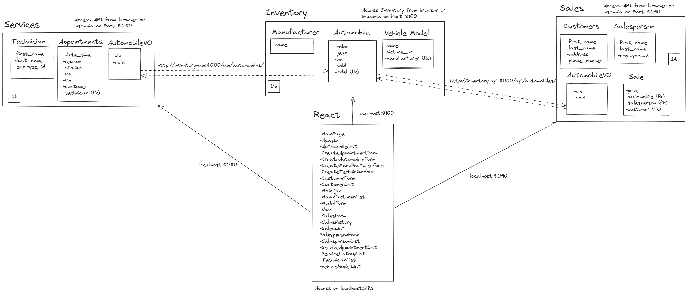

# CarCar

Team:

* Arielle Adams - Sales
* Yazan Salhani - Services

## How to Run this App

1. Fork and clone this repository to local computer
2. Run the following commands in your terminal, in the project directory:
    - docker volume create beta-data
    - docker-compose build
    - docker-compose up
 3. Open browser to localhost:5173

## Design

## API Documentation

### Sales Microservice

#### Salespeople

| Action                        | Method | URL                                           |
|-------------------------------|--------|-----------------------------------------------|
| List all salespeople          | GET    | http://localhost:8090/api/salespeople/        |
| Create a new salesperson      | POST   | http://localhost:8090/api/salespeople/        |
| Delete a specific salesperson | DELETE | http://localhost:8090/api/salespeople/:id/    |

##### List all salespeople:

Returns a dictionary with one key ("salespeople"), whose value is a list of all salesperson objects in the database.

Each salesperson will be an object containing four keys ("first_name", "last_name", "employee_id", and "id"), with the "employee_id" and "id" values being unique to each salesperson.

E.g. (if there was only one salesperson in the database):

{  
    "salespeople": [  
        {  
            "first_name": string,  
            "last_name": string,  
            "employee_id": string,  
            "id": number  
        }  
    ]  
}  

##### Create a new salesperson:

Creates a new salesperson object, and returns the details of the salesperson object that was created.

Each salesperson will be an object containing four keys ("first_name", "last_name", "employee_id", and "id"), with the "employee_id" and "id" values being unique to each salesperson.

The body of the POST request should follow this structure:

{  
    "first_name": string,  
    "last_name": string,  
    "employee_id": string,  
}  

The data returned will also follow the same structure, with the addition of the unique "id" of the salesperson:

{  
    "first_name": string,  
    "last_name": string,  
    "employee_id": string,  
    "id": number  
}  

##### Delete a salesperson:

Deletes a specific salesperson (as specified by the :id) from the database . The return value will be a dictionary containing the object that was deleted OR a message of failure.

If the salesperson was successfully deleted, the return will be in this format:

{  
    "first_name": string,  
    "last_name": string,  
    "employee_id": string,  
    "id": null  
}  

If the salesperson was not successfully deleted, the return will be:

{"Message": "Salesperson does not exist"}

#### Customers

| Action                        | Method | URL                                           |
|-------------------------------|--------|-----------------------------------------------|
| List all customers            | GET    | http://localhost:8090/api/customers/          |
| Create a new customer         | POST   | http://localhost:8090/api/customers/          |
| Delete a specific customer    | DELETE | http://localhost:8090/api/customers/:id/     |

##### List all customers:

Returns a dictionary with one key ("customers"), whose value is a list of all customer objects in the database.

Each customer will be an object containing five keys ("first_name", "last_name", "address", "phone_number", and "id"). The "id" value will be unique to each customer.

E.g. (if there was only one customer in the database):

{ 
    "customers": [  
        {  
            "first_name": string,  
            "last_name": string,  
            "address": string,  
            "phone_number": string,  
            "id": number  
        }  
    ]  
}  

##### Create a new customer:

Creates a new customer object, and returns the details of the customer object that was created.

Each customer will be an object containing five keys ("first_name", "last_name", "address", "phone_number", and "id"). The "id" value will be unique to each customer.

The body of the POST request should follow this structure, and the data returned will also follow this structure:

{  
    "first_name": string,  
    "last_name": string,  
    "address": string,  
    "phone_number": string,  
}  

The data returned will also follow this structure, with the addition of the unique "id" of the customer:

{  
    "first_name": string,  
    "last_name": string,  
    "address": string,  
    "phone_number": string,  
    "id": number  
}  

##### Delete a customer:

Deletes a specific customer (as specified by the :id) from the database. The return value will be a dictionary containing the object that was deleted OR a message of failure.

If the customer was successfully deleted, the return will follow this format:

{  
    "first_name": string,  
    "last_name": string,  
    "address": string,  
    "phone_number": string,  
    "id": null  
}  

If the customer was not successfully deleted, the return will be:

{"Message": "Customer does not exist"}

#### Sales

| Action                        | Method | URL                                           |
|-------------------------------|--------|-----------------------------------------------|
| List all sales                | GET    | http://localhost:8090/api/sales/              |
| Create a sale                 | POST   | http://localhost:8090/api/sales/              |
| Delete a specific sale        | DELETE | http://localhost:8090/api/sales/:id/         |

##### List all sales:

Returns a dictionary with one key ("sales"), whose value is a list of all sales objects in the database.

Each sale will be an object containing five keys ("price", "automobile", "salesperson", "customer", and "id").

The "automobile", "salesperson", and "customer" properties are foreign keys to their respective models, and the data will return the associated object of each for the specific sale.

E.g. (if there was only one sale in the database):

{ 
    "sales": [  
        "price": number, 
        "automobile": { 
            "vin": string, 
            "sold": boolean 
        }, 
        "salesperson": { 
            "first_name": string, 
            "last_name": string, 
            "employee_id": string, 
            "id": number 
        }, 
        "customer": { 
            "first_name": string, 
            "last_name": string, 
            "address": string, 
            "phone_number": string, 
            "id": number 
        }, 
        "id": number 
    ] 
}, 

##### Create a new sale:

Creates a new sale object, and returns the details of the sale object that was created.

Each sale will be an object containing five keys ("price", "automobile", "salesperson", "customer", and "id").

The "automobile", "salesperson", and "customer" properties are foreign keys to their respective models, and the data will return the associated object of each for the specific sale.

The body of the POST request should follow this structure, with the automobile string containing the unique "vin" for the associated automobile, and the numbers for salesperson and customer being the ids of the associated salesperson and customer (respectively):

{ 
	"automobile": string,  
	"salesperson": number,  
	"customer": number,  
	"price": number  
} 

The data returned will follow this structure:

{ 
    "sales": [  
        "price": number, 
        "automobile": { 
            "vin": string, 
            "sold": boolean 
        }, 
        "salesperson": { 
            "first_name": string, 
            "last_name": string, 
            "employee_id": string, 
            "id": number 
        }, 
        "customer": { 
            "first_name": string, 
            "last_name": string, 
            "address": string, 
            "phone_number": string, 
            "id": number 
        }, 
        "id": number 
    ] 
}, 

##### Delete a sale:

Deletes a specific sale (as specified by the :id) from the database. The return value will be a dictionary containing the object that was deleted OR a message of failure.

If the sale was successfully deleted, the return will following this formant:

{ 
	"price": number,  
	"automobile": {  
		"vin": string,  
		"sold": boolean  
	},  
	"salesperson": {  
		"first_name": string,  
		"last_name": string,  
		"employee_id": string,  
		"id": number  
	},  
	"customer": {  
		"first_name": string,  
		"last_name": string,  
		"address": string,  
		"phone_number": string,  
		"id": number  
	},  
	"id": null  
}  

If the salesperson was not successfully deleted, the return will be one of the following (depending on the error):

{"Message": "Invalid automobile."}

{"Message": "Invalid salesperson."}

{"Message": "Invalid customer."}

### Services Microservice

#### Technicians

| Action                        | Method | URL                                           |
|-------------------------------|--------|-----------------------------------------------|
| List all technicians          | GET    | http://localhost:8080/api/technicians/        |
| Create a new technician       | POST   | http://localhost:8090/api/technicians/        |
| Delete a specific technician  | DELETE | http://localhost:8090/api/technicians/:id/    |

##### List all technicians:

Returns a dictionary with one key ("technicians"), whose value is a list of all technician objects in the database.

Each technician will be an object containing four keys ("first_name", "last_name", "employee_id", and "id"), with the "employee_id" and "id" values being unique.

E.g. (if there was only one technician in the database):

{  
    "technicians": [  
        {  
            "first_name": string,  
            "last_name": string,  
            "employee_id": string,  
            "id": number  
        }  
    ]  
}  

##### Create a new technician:

Creates a new technician object, and returns the details of the technician object that was created.

Each technician will be an object containing four keys ("first_name", "last_name", "employee_id", and "id"), with the "employee_id" and "id" values being unique to each technician.

The body of the POST request should follow this structure:

{  
    "first_name": string,  
    "last_name": string,  
    "employee_id": string,  
}  

The data returned will also follow this structure, with the addition of the "id" property:

{  
    "first_name": string,  
    "last_name": string,  
    "employee_id": string,  
    "id": number  
}  

##### Delete a technician:

Deletes a specific technician (as specified by the :id) from the database. The return value will be a message of success or failure.

If the technician was successfully deleted, the return will be:

{"message": "Technician was deleted"}

if the technician was not successfully deleted, the return will be:

{"message": "Does not exist"}

#### Appointments

| Action                               | Method | URL                                                  |
|--------------------------------------|--------|------------------------------------------------------|
| List all appointments                | GET    | http://localhost:8090/api/appointments/              |
| Create a new appointments            | POST   | http://localhost:8090/api/appointments/              |
| Delete a specific appointments       | DELETE | http://localhost:8090/api/appointments/:id/         |
| Set appointment status to "cancelled"| PUT    | http://localhost:8090/api/appointments/:id/cancel/   |
| Set appointment status to "finished" | PUT    | http://localhost:8090/api/appointments/:id/finish/  |

##### List all appointments:

Returns a dictionary with one key ("appointments"), whose value is a list of all appointment objects in the database.

Each appointment will be an object containing 8 keys ("date_time", "reason", "status", "vin", "vip", "customer", "technician", and "id"). The "id" value will be unique to each appointment.

E.g. (if there was only one appointment in the database):

{ 
    "appointments": [  
        {  
            "date_time": string,  
            "reason": string,  
            "status": string,  
            "vin": string,  
            "vip": boolean,  
            "customer": string,  
            "technician': {  
                "first_name": string,  
                "last_name": string,  
                "employee_id": string,  
                "id": number  
            }  
            "id": number  
        }  
    ]  
}  

##### Create a new appointment:

Creates a new appointment object, and returns the details of the appointment object that was created.

Each appointment will be an object containing eight keys ("date_time", "reason", "status", "vin", "vip", "customer", "technician", and "id"). The "id" value will be unique to each customer.

The body of the POST request should follow this structure, with the technican input being the "id" of the associated technician:

{  
    "date_time": string,  
    "reason": string,  
    "vin": string,  
    "customer": string,  
    "technician": number  
}  

The data returned will follow this structure:

{  
    "date_time": string,  
    "reason": string,  
    "status": string,  
    "vin": string,  
    "vip": boolean,  
    "customer": string,  
    "technician': {  
        "first_name": string,  
        "last_name": string,  
        "employee_id": string,  
        "id": number  
    }  
    "id": number  
}  

##### Delete an appointment:

Deletes a specific appointment (as specified by the :id) from the database. The return value will be a message of success or failure.

If the appointment was successfully deleted, the return will follow this format:

{"message": "Appointment was deleted"}

If the appointment was not successfully deleted, the return will be:

{"message": "Does not exist"}

##### Set appointment status to cancelled:

(From the browser): When a user clicks the cancel button, a PUT request to the back-end containing the updated value of the appointment's "status" key, changing it to "cancelled"

##### Set appointment status to finished:

(From the browser): When a user clicks the finish button, a PUT request to the back-end containing the updated value of the appointment's "status" key, changing it to "finished"

## URLs and Ports

### React Browser: http://localhost:5173

### Inventory API can be accessed from the browser or third party API client on port 8100, and from other microservices using port 8000 (http://inventory-api:8000/api/)

### Services Microservice

#### Services microservice can be accessed from browser and third party API client on port 8080

| Action                               | From Third Party API Client                        | In Browser                                         |
|--------------------------------------|----------------------------------------------------|----------------------------------------------------|
| List all technicians                 | http://localhost:8080/api/technicians/             | http://localhost:5173/api/technicians/             |
| Create a new technician              | http://localhost:8080/api/technicians/             | http://localhost:5173/api/technicians/             |
| Delete a specific technician         | http://localhost:8080/api/technicians/:id/         | not configured                                     |
| List all appointments                | http://localhost:8080/api/appointments/            | http://localhost:5173/api/appointments/            |
| Create a new appointment             | http://localhost:8080/api/appointments/            | http://localhost:5173/api/appointments/create/     |
| Delete an appointment                | http://localhost:8080/api/appointments/:id/        | not configured                                     |
| Set appointment status to "cancelled"| http://localhost:8080/api/appointments/:id/cancel/ | http://localhost:5173/api/appointments/:id/cancel/ |
| Set appointment status to "finished" | http://localhost:8080/api/appointments/:id/finish/ | http://localhost:5173/api/appointments/:id/finish/ |

### Sales Microservice

#### Sales microservice can be accessed from browser and third party API client on port 8090

| Action                        | From Third Party API Client                | In Browser                                  |
|-------------------------------|--------------------------------------------|---------------------------------------------|
| List all salespeople          | http://localhost:8090/api/salespeople/     | http://localhost:5173/api/salespeople/      |
| Create a new salesperson      | http://localhost:8090/api/salespeople/     | http://localhost:5173/api/salespeople/      |
| Delete a specific salesperson | http://localhost:8090/api/salespeople/:id/ | not configured                              |
| List all customers            | http://localhost:8090/api/customers/       | http://localhost:5173/api/customers/        |
| Create a new customer         | http://localhost:8090/api/customers/       | http://localhost:5173/api/customers/create/ |
| Delete a customer             | http://localhost:8090/api/customers/:id/   | not configured                              |
| List all sales                | http://localhost:8090/api/sales/           | http://localhost:5173/api/sales/            |
| Create a new sale             | http://localhost:8090/api/customers/       | http://localhost:5173/api/sales/create/     |
| Delete a sale                 | http://localhost:8090/api/salespeople/:id/ | not configured                              |

## Service microservice

### Technician, Appointments, and AutomobileVO Models

#### Technician Model

Technician model contains these attributes:
- first_name, which is a CharField containing a string
- last_name, which is a CharField containing a string
- employee_id, which is a CharField containing a string. The employee_id must be unique for each salesperson.

#### Appointments Model

Appointments Model contains these attributes:
- date_time, which will be a DateTime field
- reason, which is a CharField containing a string
- status, which is a CharField containing a string
- vip, which is a CharField containing a string
- vin, which is a CharField containing a string
- customer, which is a CharField containing a string
- technician, which is a foreign key to the Technician model

#### AutomobileVO Model

The AutomobileVO objects will be updated or created as a result of the poller requesting data from the Automobile model in the Inventory microservce. The AutomobileVO model contains these attributes:
- vin, which will be Charfield containing a string
- sold, which will be a boolean

#### Integration with Inventory microservice

To integrate with the Inventory microservice, a poller was created that checks every 60 seconds for new Automobile objects, and then creates (or updates) a corresponding AutomobileVO object that can be used within the Servuces microservice.

## Sales microservice

### Salesperson, Customer, Sale, and AutomobileVO Models

#### Salesperson Model

Salesperson model contains these attributes:
- first_name, which is a CharField containing a string
- last_name, which is a CharField containing a string
- employee_id, which is a CharField containing a string. The employee_id must be unique for each salesperson.

#### Customer Model

Customer model contains these attributes:
- first_name, which is a CharField containing a string
- last_name, which is a CharField containing a string
- address, which is a CharField containing a string
- phone_number, which is a CharField containing a string.

#### Sale Model

Sale model contains these attributes:
- price, which must be a positive integer
- salesperson, which is a foreign key to the Salesperson model
- customer, which is a foreign key to the Customer model
- automobile, which is a foreign key to the AutomobileVO model

#### AutomobileVO Model

The AutomobileVO objects will be updated or created as a result of the poller requesting data from the Automobile model in the Inventory microservce. The AutomobileVO model contains these attributes:
- vin, which will be Charfield containing a string
- sold, which will be a boolean

#### Integration with Inventory microservice

To integrate with the Inventory microservice, a poller was created that checks every 60 seconds for new Automobile objects, and then creates (or updates) a corresponding AutomobileVO object that can be used within the Sales microservice.

## Value Objects

### Sales Microservice
- Automobile Value Object (AutomobileVO)

### Services Microservice
- Automobile Value Object (AutomobileVO)
